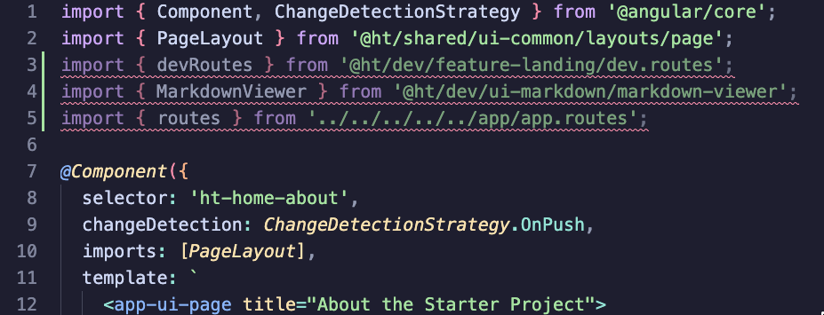
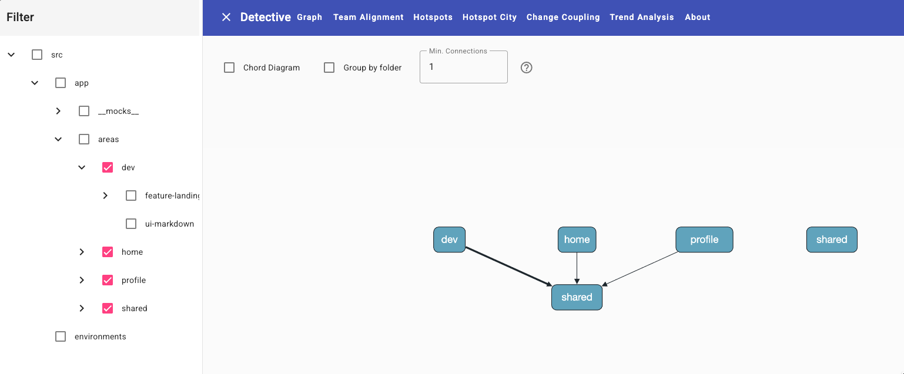

# TDR: Use Sheriff to Enforce Module Boundaries

**Status:** Accepted
**Date:** 2025-01-01

## Context

The [module boundaries TDR](./boundaries.md) establishes that boundary rules must be enforced by tooling, not convention alone. We need a tool that:

- Integrates with the existing ESLint workflow (already present in every Angular project)
- Can tag modules by their folder path pattern without requiring manual configuration per module
- Enforces both *dependency rules* (who can use what) and *encapsulation* (internal folders are private)
- Provides clear, actionable developer feedback in the IDE
- Is MIT licensed and free

## Decision

We will use [Sheriff](https://sheriff.softarc.io/) from SoftArc (`@softarc/sheriff-core` + `@softarc/eslint-plugin-sheriff`) to enforce module boundaries.

### Configuration

A `sheriff.config.ts` at the project root maps folder patterns to tags, and defines dependency rules between those tags:

```ts
import { sameTag, SheriffConfig } from '@softarc/sheriff-core';

export const config: SheriffConfig = {
  autoTagging: true,
  entryFile: 'src/main.ts',
  enableBarrelLess: true,
  modules: {
    'src/app/areas/<domain>/feature-<name>': ['area:<domain>', 'type:feature'],
    'src/app/areas/<domain>/ui-<name>':      ['area:<domain>', 'type:ui'],
    'src/app/areas/<domain>/data':           ['area:<domain>', 'type:data'],
    'src/app/areas/<domain>/util-<name>':    ['area:<domain>', 'type:util'],
  },
  depRules: {
    root:           '*',
    'area:*':       [sameTag, 'area:shared'],
    'type:feature': ['type:ui', 'type:data', 'type:util'],
    'type:ui':      ['type:data', 'type:util'],
    'type:data':    ['type:util'],
    'type:util':    [],
  },
};
```

Key options:

- **`autoTagging: true`** — anything reachable from `entryFile` that isn't explicitly tagged is automatically tagged `root`
- **`enableBarrelLess: true`** — barrel files (`index.ts`) are not required; Sheriff enforces encapsulation directly via `internal/` folders instead

### Developer Experience

Violations appear as red squiggles in the IDE immediately:



### CLI Commands

```sh
# Verify all rules are satisfied
npx sheriff verify
# (also available as: npm run sheriff:check)

# List all detected modules and their tags
npx sheriff list
```

### Why Barrel-less?

Barrel files (`index.ts` that re-exports everything) were originally used to:
1. Simulate "public API" visibility (only re-export what you want shared)
2. Reduce the number of import paths

However, in *application* code, barrels are problematic:

- They are not tree-shakable — because `index.ts` might have side effects, any change to a file in the barrel invalidates the whole barrel's cache
- This breaks Vite's Hot Module Replacement (HMR) — instead of replacing just the changed module, the entire barrel and all its consumers reload
- Developer productivity suffers; the app loses state on changes that should be invisible

With Sheriff enforcing `internal/` boundaries, the "public API" benefit of barrels is replaced by a more explicit and IDE-visible mechanism. We get the encapsulation without the cache/HMR penalty.

### Optional: Detective

[Detective](https://github.com/angular-architects/detective) is a companion tool that visualizes module dependencies and provides:

- **Hot spot analysis** — which modules change frequently, causing ripple redeployments
- **Team alignment** — who is changing what and where



It is optional but useful on larger projects.

## Consequences

**Benefits:**
- Violations are caught at lint time, in the IDE, with no extra tooling invocation required
- New modules are automatically tagged by folder naming convention — no manual registration
- `enableBarrelLess` improves HMR performance during development
- MIT licensed; no vendor lock-in, no cost
- `npx sheriff list` gives a live map of the module graph that always reflects reality

**Trade-offs:**
- Adds a `sheriff.config.ts` file to the project root that developers must understand
- ESLint-level enforcement can be bypassed with `// eslint-disable` (a social, not technical, constraint)
- `enableBarrelLess` means import paths are longer (e.g., `import ... from '@ht/shared/ui-common/button'` instead of `@ht/shared/ui-common'`) — mitigated by TypeScript path aliases

## Alternatives Considered

**Nx with buildable libraries.** Enforces at build time, not just lint time — stronger guarantee. But Nx workspace setup is heavy and introduces significant complexity for most teams.

**Custom ESLint rules.** Possible but requires significant maintenance. Sheriff solves this already with better ergonomics.

**No tooling (documentation only).** See [Module Boundaries TDR](./boundaries.md) — this was explicitly rejected.
